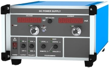

# FuG Control

## Simple command line interface for controlling a FuG power supply.

This allows to control a FuG power supply (e.g. [HCP14](https://www.xppower.com/product/HCP14-Series)) with an Ethernet interface.



Additionally, when run with the command-line argument `-i`, the interlock signal
from a Tofwerk TOF power supply is monitored and the FuG output is switched off
if an interlock occurs.

See the [FuG command reference](https://www.xppower.com/products/series/resources/Digital_Interface_Command_Reference_Probus_V.pdf)
for a complete list of available power supply commands.


### Usage
```
python FuG_Control.py [-h] [-i]
```
